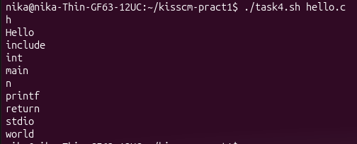
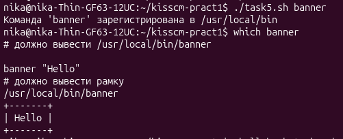
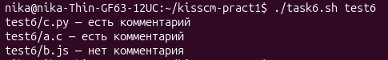
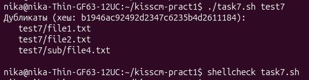

# Практическое занятие №1. Конфигурационное управление

**Студент:** Гейленко Ника  
**Группа:** ИКБО-42-25  
**Дата:** 19.09.2026

## Цель работы

Научиться выполнять простые действия с файлами и каталогами в Linux из командной строки. Сравнить работу в командной строке Windows и Linux.

## Среда выполнения

- ОС: Ubuntu (WSL 2)
- Оболочка: bash

---

## Задача 1. Список пользователей из /etc/passwd

**Условие:** вывести отсортированный в алфавитном порядке список имён пользователей в файле passwd.

**Команда:**

    grep -o '^[^:]*' /etc/passwd | sort

**Результат:**

Скрипт: [task1.sh](task1.sh)

---

## Задача 2. 5 наибольших портов из /etc/protocols

**Условие:** вывести данные /etc/protocols для 5 наибольших портов.

**Команда:**

    grep -v '^#' /etc/protocols | sort -nr | head -n 5 | awk '{print $1, $2}'

**Результат:**

Скрипт: [task2.sh](task2.sh)

---

## Задача 3. Программа banner

**Условие:** написать программу banner средствами bash для вывода текста в рамке. Размер баннера должен меняться в зависимости от длины текста.

**Код:**

    #!/bin/bash
    # Задача 3. Программа banner — выводит текст в рамке

    if [ $# -eq 0 ]; then
        echo "Использование: $0 \"текст для баннера\""
        exit 1
    fi

    text="$1"
    len=${#text}

    printf '+'
    printf -- '-%.0s' $(seq 1 $((len + 2)))
    printf '+\n'

    printf '| %s |\n' "$text"

    printf '+'
    printf -- '-%.0s' $(seq 1 $((len + 2)))
    printf '+\n'

**Результат:**

Скрипт: [task3.sh](task3.sh)

---

## Задача 4. Вывод идентификаторов из файла

**Условие:** написать программу для вывода всех идентификаторов (по правилам C/C++ или Java) в файле (без повторений).

**Код:**

    #!/bin/bash
    # Задача 4. Вывод всех идентификаторов в файле (без повторений)

    if [ $# -eq 0 ]; then
        echo "Использование: $0 <файл>"
        exit 1
    fi

    grep -oE '[a-zA-Z_][a-zA-Z0-9_]*' "$1" | sort -u

**Результат:**

Скрипты: [task4.sh](task4.sh), пример файла: [hello.c](hello.c)

---

## Задача 5. Регистрация пользовательской команды

**Условие:** написать программу для регистрации пользовательской команды (правильные права доступа и копирование в /usr/local/bin).

**Код:**

    #!/bin/bash
    # Задача 5. Регистрация пользовательской команды

    if [ $# -eq 0 ]; then
        echo "Использование: $0 <файл>"
        exit 1
    fi

    src="$1"

    if [ ! -f "$src" ]; then
        echo "Ошибка: файл '$src' не найден"
        exit 1
    fi

    chmod +x "$src"
    sudo cp "$src" /usr/local/bin/

    echo "Команда '$src' зарегистрирована в /usr/local/bin"

**Результат:**

Скрипт: [task5.sh](task5.sh), зарегистрированная команда: [banner](banner)

---

## Задача 6. Проверка комментария в первой строке

**Условие:** написать программу для проверки наличия комментария в первой строке файлов с расширением c, js и py.

**Код:**

    #!/bin/bash
    # Задача 6. Проверка комментария в первой строке файлов .c, .js, .py

    if [ $# -eq 0 ]; then
        echo "Использование: $0 <каталог>"
        exit 1
    fi

    dir="$1"

    if [ ! -d "$dir" ]; then
        echo "Ошибка: '$dir' — не каталог"
        exit 1
    fi

    find "$dir" -type f \( -name '*.c' -o -name '*.js' -o -name '*.py' \) | while read -r file; do
        first_line=$(head -n 1 "$file")

        case "$file" in
            *.py)
                if [[ "$first_line" =~ ^[[:space:]]*# ]]; then
                    echo "$file — есть комментарий"
                else
                    echo "$file — нет комментария"
                fi
                ;;
            *.c|*.js)
                if [[ "$first_line" =~ ^[[:space:]]*(//|/\*) ]]; then
                    echo "$file — есть комментарий"
                else
                    echo "$file — нет комментария"
                fi
                ;;
        esac
    done

**Результат:**

Скрипт: [task6.sh](task6.sh)

---

## Задача 7. Поиск файлов-дубликатов

**Условие:** написать программу для нахождения файлов-дубликатов (имеющих 1 или более копий содержимого) по заданному пути (и подкаталогам).

**Код:**

    #!/bin/bash
    # Задача 7. Поиск файлов-дубликатов

    if [ $# -eq 0 ]; then
        echo "Использование: $0 <каталог>"
        exit 1
    fi

    dir="$1"

    if [ ! -d "$dir" ]; then
        echo "Ошибка: '$dir' — не каталог"
        exit 1
    fi

    find "$dir" -type f -exec md5sum {} \; | sort > /tmp/hashes.txt

    duplicates=$(awk '{print $1}' /tmp/hashes.txt | uniq -d)

    if [ -z "$duplicates" ]; then
        echo "Дубликатов не найдено"
        exit 0
    fi

    echo "$duplicates" | while read -r hash; do
        echo "Дубликаты (хеш: $hash):"
        grep "^$hash" /tmp/hashes.txt | awk '{$1=""; print "  " $0}'
        echo ""
    done

    rm -f /tmp/hashes.txt

**Результат:**

Скрипт: [task7.sh](task7.sh)
