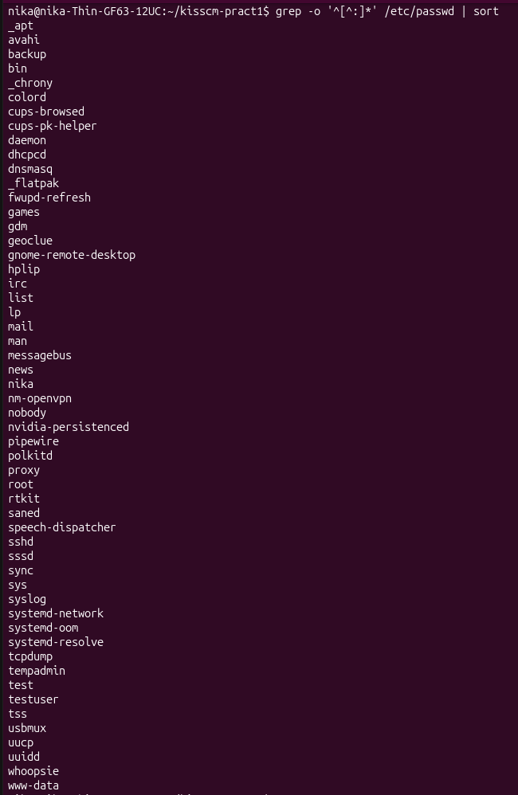
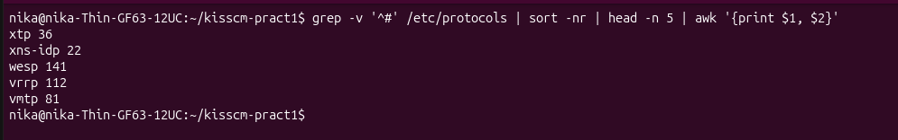
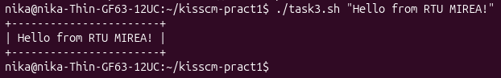

# Практическое занятие №1. Конфигурационное управление

**Студент:** Гейленко Ника  
**Группа:** ИКБО-42-25  
**Дата:** 19.09.2026

## Цель работы

Научиться выполнять простые действия с файлами и каталогами в Linux из командной строки. Сравнить работу в командной строке Windows и Linux.

## Среда выполнения

- ОС: Ubuntu (WSL 2)
- Оболочка: bash

---

## Задача 1. Список пользователей из /etc/passwd

**Условие:** вывести отсортированный в алфавитном порядке список имён пользователей в файле passwd.

**Команда:**

    grep -o '^[^:]*' /etc/passwd | sort

**Результат:**

Скрипт: [task1.sh](task1.sh)

---

## Задача 2. 5 наибольших портов из /etc/protocols

**Условие:** вывести данные /etc/protocols для 5 наибольших портов.

**Команда:**

    grep -v '^#' /etc/protocols | sort -nr | head -n 5 | awk '{print $1, $2}'

**Результат:**

Скрипт: [task2.sh](task2.sh)

---

## Задача 3. Программа banner

**Условие:** написать программу banner средствами bash для вывода текста в рамке. Размер баннера должен меняться в зависимости от длины текста.

**Код:**

    #!/bin/bash
    # Задача 3. Программа banner — выводит текст в рамке

    if [ $# -eq 0 ]; then
        echo "Использование: $0 \"текст для баннера\""
        exit 1
    fi

    text="$1"
    len=${#text}

    printf '+'
    printf -- '-%.0s' $(seq 1 $((len + 2)))
    printf '+\n'

    printf '| %s |\n' "$text"

    printf '+'
    printf -- '-%.0s' $(seq 1 $((len + 2)))
    printf '+\n'

**Результат:**

Скрипт: [task3.sh](task3.sh)
