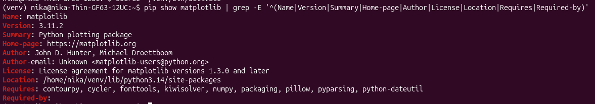
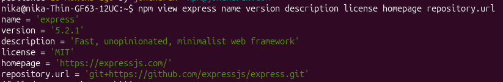
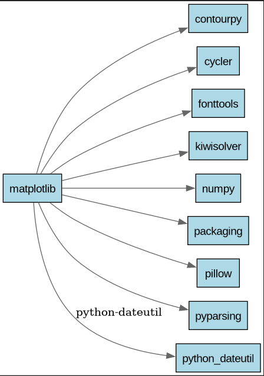
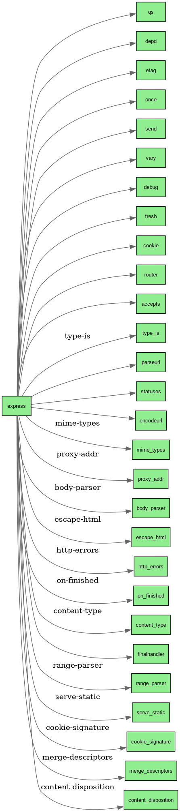
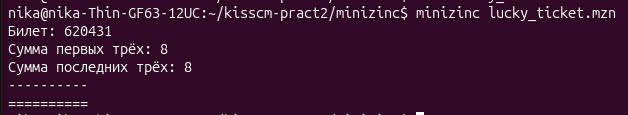
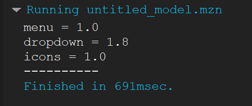
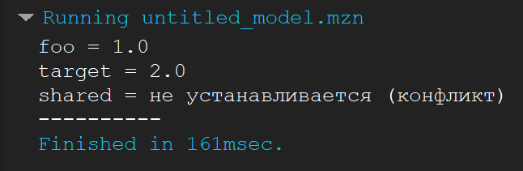
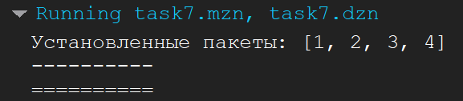

# Практическое занятие №2. Конфигурационное управление. Менеджеры пакетов

**Студент:** Гейленко Ника  
**Группа:** ИКБО-42-25

## Цель работы

Изучить назначение менеджеров пакетов, структуру пакетов и правила записи версий по стандарту SemVer. Научиться получать служебную информацию о пакетах, строить графы зависимостей и решать задачи о совместимости версий с помощью MiniZinc.

## Средства выполнения

- Python и менеджер пакетов pip
- JavaScript и менеджер пакетов npm
- Graphviz
- MiniZinc IDE

---

## Задача 1. Служебная информация о пакете matplotlib

**Условие:** вывести служебную информацию о пакете matplotlib (Python). Разобрать основные элементы файла со служебной информацией из пакета. Рассмотреть получение пакета без менеджера пакетов, напрямую из репозитория.

**Выполнение:**

Получена служебная информация о пакете matplotlib. Рассмотрены основные поля метаданных: название, версия, описание, сведения об авторе, лицензия и зависимости. Изучен способ получения исходного кода пакета напрямую из его репозитория.

**Команда:**

```bash
pip show matplotlib | grep -E '^(Name|Version|Summary|Home-page|Author|License|Location|Requires|Required-by)'
```

Команда `pip show` выводит сведения об установленном пакете, а `grep` оставляет строки с выбранными полями.

**Разбор служебной информации:**

В установленном Python-пакете основные метаданные находятся в файле `METADATA` внутри каталога `matplotlib-<версия>.dist-info`. В архиве исходного дистрибутива соответствующие сведения могут находиться в файле `PKG-INFO`.

| Поле метаданных | Назначение |
| --- | --- |
| `Metadata-Version` | Версия формата метаданных |
| `Name` | Название пакета |
| `Version` | Версия пакета |
| `Summary` | Краткое описание назначения пакета |
| `Home-page` / `Project-URL` | Ссылки на сайт, документацию или репозиторий проекта |
| `Author` / `Author-email` | Сведения об авторе, если они указаны |
| `License` / `License-Expression` | Сведения о лицензии; набор полей зависит от версии формата метаданных |
| `Requires-Python` | Ограничение на версию Python |
| `Requires-Dist` | Зависимости пакета, включая ограничения версий и условия применения |

В выводе `pip show` поле `Location` показывает каталог установки, `Requires` - названия зависимостей, а `Required-by` - установленные пакеты, зависящие от matplotlib. Это сведения, сформированные pip; они не обязательно являются одноимёнными полями файла `METADATA`.

Описание формата: [Python Core Metadata](https://packaging.python.org/en/latest/specifications/core-metadata/).

**Получение исходников без менеджера пакетов:**

Исходный код можно получить непосредственно из [официального репозитория matplotlib](https://github.com/matplotlib/matplotlib):

```bash
git clone https://github.com/matplotlib/matplotlib.git
```

Также можно открыть репозиторий в браузере и выбрать **Code → Download ZIP**, затем распаковать архив. Оба способа позволяют получить исходники без pip. Для использования библиотеки могут потребоваться сборка и установка зависимостей.

**Результат:**



---

## Задача 2. Служебная информация о пакете express

**Условие:** вывести служебную информацию о пакете express (JavaScript). Разобрать основные элементы файла со служебной информацией из пакета. Рассмотреть получение пакета без менеджера пакетов, напрямую из репозитория.

**Выполнение:**

Получена служебная информация о пакете express. Рассмотрена структура файла `package.json`, включая название и версию пакета, описание, лицензию и список зависимостей. Изучен способ получения исходного кода пакета напрямую из его репозитория.

**Команда:**

```bash
npm view express name version description license homepage repository.url
```

Команда выводит выбранные поля метаданных пакета из реестра npm.

**Разбор файла `package.json`:**

Служебная информация JavaScript-пакета хранится в файле `package.json` в корне пакета. Он содержит JSON-объект с описанием проекта, зависимостей и настроек.

| Поле | Назначение |
| --- | --- |
| `name` | Название пакета |
| `version` | Версия пакета |
| `description` | Краткое описание |
| `license` | Обозначение лицензии |
| `homepage` | Адрес домашней страницы проекта |
| `repository` | Сведения о репозитории; `repository.url` содержит его адрес |
| `author` / `contributors` | Сведения об авторе и участниках, если они указаны |
| `main` | Основной входной файл пакета |
| `scripts` | Команды для выполнения задач проекта, например тестирования |
| `dependencies` | Зависимости, необходимые для работы пакета, и допустимые диапазоны их версий |
| `devDependencies` | Зависимости для разработки и тестирования |
| `engines` | Требования к версиям среды выполнения, например Node.js |

Команда выше запрашивает только часть этих полей. Например, зависимости можно отдельно посмотреть командой:

```bash
npm view express dependencies
```

Описание полей: [документация npm по package.json](https://docs.npmjs.com/files/package.json/).

**Получение исходников без менеджера пакетов:**

Исходный код можно получить непосредственно из [официального репозитория express](https://github.com/expressjs/express):

```bash
git clone https://github.com/expressjs/express.git
```

Также можно скачать архив через **Code → Download ZIP** и распаковать его. Для получения исходников npm не нужен. Клонирование не устанавливает зависимости, указанные в `package.json`.

**Результат:**



---

## Задача 3. Графы зависимостей matplotlib и express

**Условие:** сформировать Graphviz-код и получить изображения зависимостей пакетов matplotlib и express.

**Выполнение:**

Подготовлены описания графов в формате DOT. Пакеты представлены вершинами, а зависимости между ними - направленными рёбрами. На основе DOT-файлов получены изображения графов.

**Команды для получения изображений из готовых DOT-файлов:**

Выполняются из папки `pract2`:

```bash
dot -Tpng graphviz/matplotlib_deps.dot -o screenshots/matplotlib_deps.png
dot -Tpng graphviz/express_deps.dot -o screenshots/express_deps.png
```

Параметр `-Tpng` задаёт формат изображения, а `-o` - путь к выходному файлу. Описание пакетов и связей между ними хранится в исходных DOT-файлах.

**Результат для matplotlib:**



Graphviz-код: [matplotlib_deps.dot](graphviz/matplotlib_deps.dot)

**Результат для express:**



Graphviz-код: [express_deps.dot](graphviz/express_deps.dot)

---

## Задача 4. Счастливые билеты в MiniZinc

**Условие:** изучить основы программирования в ограничениях, установить MiniZinc и разобраться с его синтаксисом и работой в IDE. Решить задачу о счастливых билетах, добавить условие различия всех цифр и найти минимальную сумму трёх цифр.

**Выполнение:**

Создана модель шестизначного счастливого билета. Каждая цифра принимает значение от 0 до 9. Сумма первых трёх цифр равна сумме последних трёх. Для проверки различия всех цифр используется ограничение `alldifferent`. Цель оптимизации - минимизация суммы первых трёх цифр.

**Код (`minizinc/lucky_ticket.mzn`):**

```minizinc
include "alldifferent.mzn";

var 0..9: d1;
var 0..9: d2;
var 0..9: d3;
var 0..9: d4;
var 0..9: d5;
var 0..9: d6;

constraint d1 + d2 + d3 = d4 + d5 + d6;
constraint alldifferent([d1, d2, d3, d4, d5, d6]);

var 0..27: sum3 = d1 + d2 + d3;
solve minimize sum3;

output [
    "Билет: ", show(d1), show(d2), show(d3),
    show(d4), show(d5), show(d6), "\n",
    "Сумма первых трёх: ", show(sum3), "\n",
    "Сумма последних трёх: ", show(d4 + d5 + d6), "\n"
];
```

**Результат:**



Модель: [lucky_ticket.mzn](minizinc/lucky_ticket.mzn)

---

## Задача 5. Зависимости пакетов menu, dropdown и icons

**Условие:** решить на MiniZinc задачу о зависимостях пакетов по схеме, приведённой в задании.

**Выполнение:**

Создана модель выбора версий пакетов `menu`, `dropdown` и `icons`. В модель внесены ограничения зависимостей, показанные на схеме. Выполнен поиск сочетания версий, удовлетворяющего требованиям корневого пакета и зависимостям выбранных версий.

**Результат:**



**Код (`minizinc/task5.mzn`):**

```minizinc
% Задача 5. Зависимости пакетов

% Версии пакетов (реальные номера, не индексы)
array[1..6] of float: menu_versions     = [1.0, 1.1, 1.2, 1.3, 1.4, 1.5];
array[1..5] of float: dropdown_versions = [1.8, 2.0, 2.1, 2.2, 2.3];
array[1..2] of float: icons_versions    = [1.0, 2.0];

% Переменные — индексы выбранных версий
var 1..6: menu;
var 1..5: dropdown;
var 1..2: icons;

% Ограничения из графа зависимостей

% menu 1.1.0, 1.2.0, 1.3.0 (индексы 2,3,4) зависят от dropdown 2.x (индексы 2..5)
constraint (menu == 2 \/ menu == 3 \/ menu == 4) -> (dropdown >= 2);

% menu 1.4.0, 1.5.0 (индексы 5,6) зависят от dropdown 1.8.0 (индекс 1)
constraint (menu == 5 \/ menu == 6) -> (dropdown == 1);

% root зависит от любой версии menu и icons — автоматически, дополнительных ограничений не надо
% dropdown зависит от любой версии icons — тоже автоматически

solve satisfy;

output [
  "menu = " ++ show(menu_versions[menu]) ++ "\n",
  "dropdown = " ++ show(dropdown_versions[dropdown]) ++ "\n",
  "icons = " ++ show(icons_versions[icons]) ++ "\n"
];
```

Модель: [task5.mzn](minizinc/task5.mzn)

---

## Задача 6. Зависимости пакетов с ограничениями версий

**Условие:** решить на MiniZinc задачу о зависимостях пакетов для следующих данных:

```text
root 1.0.0 зависит от foo ^1.0.0 и target ^2.0.0.
foo 1.1.0 зависит от left ^1.0.0 и right ^1.0.0.
foo 1.0.0 не имеет зависимостей.
left 1.0.0 зависит от shared >=1.0.0.
right 1.0.0 зависит от shared <2.0.0.
shared 2.0.0 не имеет зависимостей.
shared 1.0.0 зависит от target ^1.0.0.
target 2.0.0 и 1.0.0 не имеют зависимостей.
```

**Выполнение:**

Проанализирована цепочка транзитивных зависимостей. Выбор `foo 1.1.0` приводит к требованию `target 1.0.0`, которое конфликтует с требованием корневого пакета `target ^2.0.0`. По результатам анализа в модели задан выбор `foo 1.0.0` и `target 2.0.0`. Пакеты `left`, `right` и `shared` для этого варианта не требуются.

**Результат:**



**Код (`minizinc/task6.mzn`):**

```minizinc
% Задача 6. Зависимости пакетов

array[1..2] of float: foo_versions    = [1.0, 1.1];
array[1..2] of float: target_versions = [1.0, 2.0];

var 1..2: foo;
var 1..2: target;

% root требует foo ^1.0.0 (1.x.x)
constraint foo >= 1;

% root требует target ^2.0.0 (2.x.x)
constraint target == 2;

% Если foo = 1.1.0 (индекс 2), то нужны left и right → shared 1.0.0 → target 1.0.0
% Но target уже 2.0.0 → конфликт. Значит, foo не может быть 2.
constraint foo == 1;

solve satisfy;

output [
  "foo = " ++ show(foo_versions[foo]) ++ "\n",
  "target = " ++ show(target_versions[target]) ++ "\n",
  "shared = не устанавливается (конфликт)\n"
];
```

Модель: [task6.mzn](minizinc/task6.mzn)

---

## Задача 7. Общая модель зависимостей пакетов

**Условие:** представить на MiniZinc задачу о зависимостях пакетов в общей форме, чтобы конкретный экземпляр задачи описывался только своим набором данных.

**Выполнение:**

Задача представлена в виде параметризованной модели. Сведения о пакетах и их зависимостях задаются входными данными. Ограничения модели проверяют, что при установке пакета устанавливаются необходимые ему зависимости. Для решения другого экземпляра задачи меняются входные данные.

Код общей модели хранится в файле `task7.mzn`, а параметры конкретного экземпляра задачи - в файле `task7.dzn`. При запуске модели в MiniZinc IDE выбирается соответствующий файл данных.

**Результат:**



**Код (`minizinc/task7.mzn`):**

```minizinc
% packages.mzn

int: n;                       % Количество пакетов
set of int: PACKAGES = 1..n;

% depends[i,j] = true, если пакет i требует пакет j
array[PACKAGES, PACKAGES] of bool: depends;

% Пакеты, которые требуется установить
set of PACKAGES: requested;

% Решение: какие пакеты устанавливаются
array[PACKAGES] of var bool: installed;

constraint forall(i in requested)(
    installed[i]
);

constraint forall(i, j in PACKAGES)(
    (installed[i] /\ depends[i,j]) -> installed[j]
);

% Выбираем минимальный набор установленных пакетов
solve minimize sum(i in PACKAGES)(bool2int(installed[i]));

output [
    "Установленные пакеты: ",
    show([i | i in PACKAGES where fix(installed[i])])
];
```

Модель: [task7.mzn](minizinc/task7.mzn)

**Данные (`minizinc/task7.dzn`):**

```minizinc
n = 5;
requested = {1};

depends = [|
    false, true,  true,  false, false |
    false, false, false, true,  false |
    false, false, false, false, false |
    false, false, false, false, false |
    false, false, false, false, false
|];
```

Данные: [task7.dzn](minizinc/task7.dzn)

---

## Вывод

В ходе работы изучены служебные сведения и зависимости пакетов Python и JavaScript. Построены графы зависимостей с помощью Graphviz. Освоены основы программирования в ограничениях в MiniZinc, решены задача о счастливых билетах и задачи выбора совместимых версий пакетов. Подготовлена общая модель зависимостей, параметры которой задаются входными данными.
